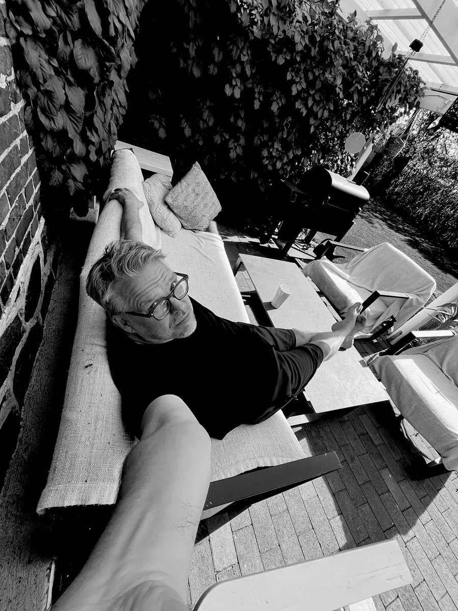

  

<h1 align="center">Norrtou Creations</h1>

  <em>Ord, funktion &amp; människa — appar, webb och text från Norrto på Skånska slätten.</em>

  <a href="https://norrtou.se"><strong>norrtou.se&nbsp;→</strong></a>

---

## Om det här repot

Det här är källkoden till **[norrtou.se](https://norrtou.se)** — Norrtou Creations webbplats. En helt statisk sajt utan ramverk och byggsteg: handskriven HTML, CSS och vanilla JavaScript, publicerad via GitHub Pages.

- 🖤 Svartvit monokrom design med egna fotografier från trakten kring Norrto
- ⚡ Snabb även på dålig täckning — inga tunga beroenden
- ♿ Tillgänglighet och teknisk SEO inbyggt från start (WCAG, strukturerad data, sitemap)
- 📰 [Nyhetssida](https://norrtou.se/blog/) driven av en enkel JSON-fil — inget CMS

## Projekt

Webbappar från studion, gratis och direkt i webbläsaren:

| Projekt | Beskrivning | Länk |
| --- | --- | --- |
| **Anatomiquiz** | Öva anatomi och medicinsk terminologi med quiz och flashcards — för studenter inom vård och medicin | [anatomiquiz.se](https://anatomiquiz.se) |
| **Aktivitetsdagboken** | Digital aktivitetsdagbok för arbetsterapi — kartlägg dygnets aktiviteter, energi och mående | [Öppna appen](https://norrtou.github.io/activitydiary/) |
| **HEC** | Hand-öga-koordinationstest för yrkesverksamma inom vård, medicin och terapi | [Öppna appen](https://norrtou.github.io/HEC/) |
| **Small Steps** | Bryt ner till synes stora uppgifter i små, hanterbara steg | [Öppna appen](https://norrtou.github.io/smallsteps/) |
| **Leonoria** | Levande fantasyvärld för bordsrollspel — procedurellt genererade världar, kartor och karaktärer | [Öppna appen](https://norrtou.github.io/leonoria/) |
| **Norrtounia** | Textbaserat retro-dungeon crawler i en mörk fantasyvärld | [Spela](https://norrtou.github.io/norrtounia/) |

Fler projekt dyker upp löpande på [norrtou.se/#projekt](https://norrtou.se/#projekt).

## Kontakt

Daniel — [norrtou.se/#kontakt](https://norrtou.se/#kontakt) · [LinkedIn](https://www.linkedin.com/in/danielmedin) · [GitHub](https://github.com/norrtou)

  © 2026 Norrtou Creations · Norrto, Skåne · 55° N · 13° E

